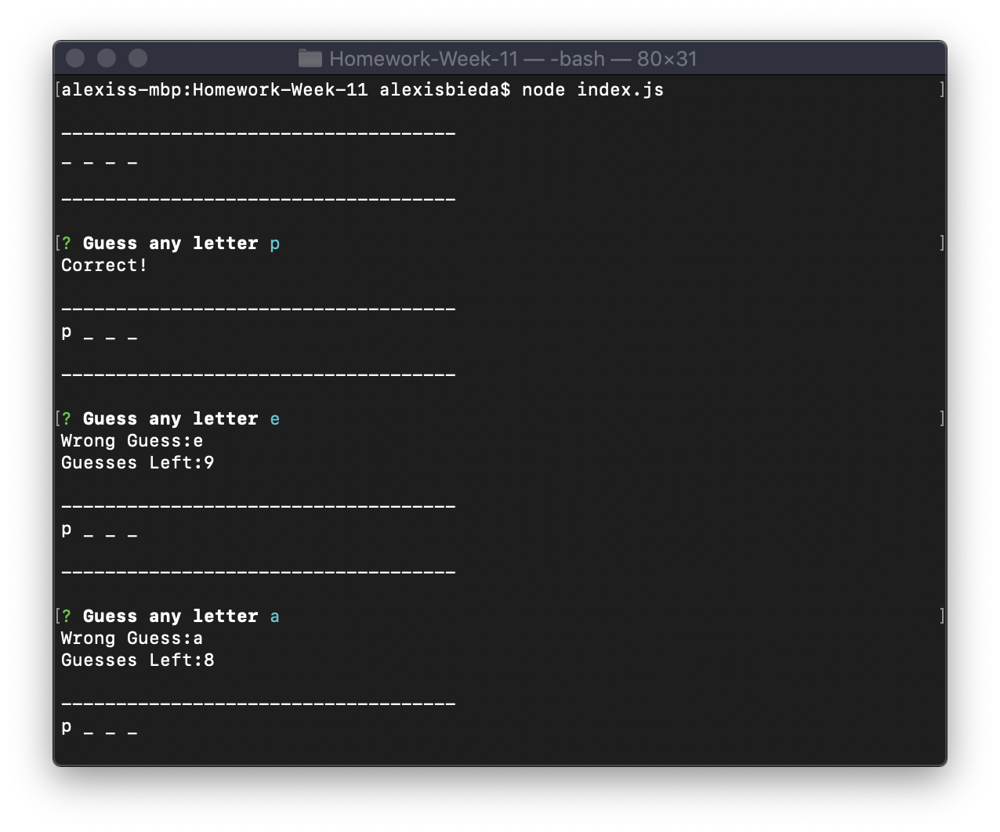
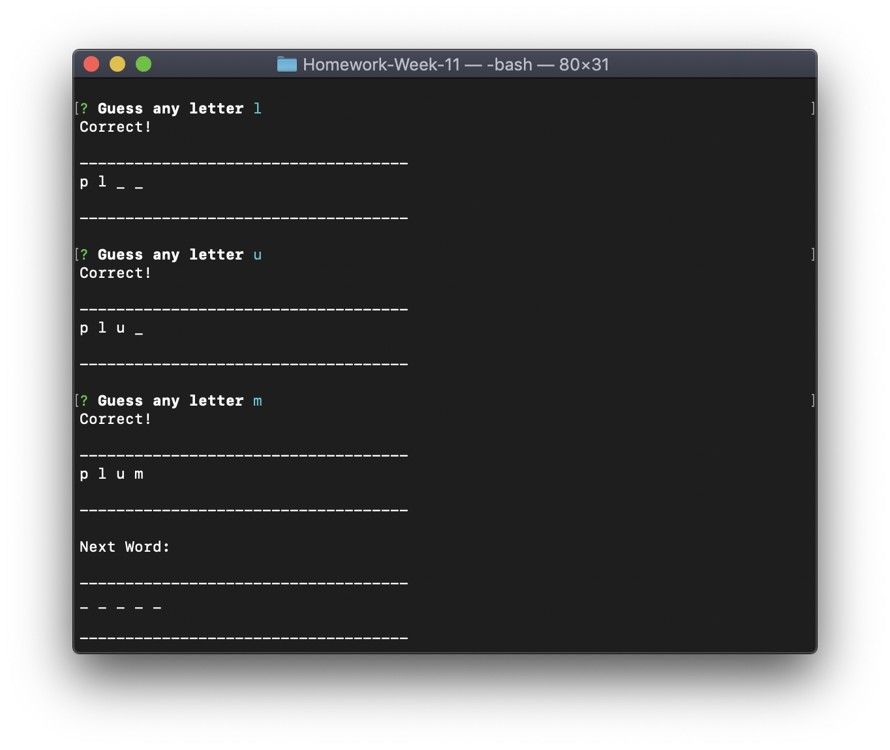
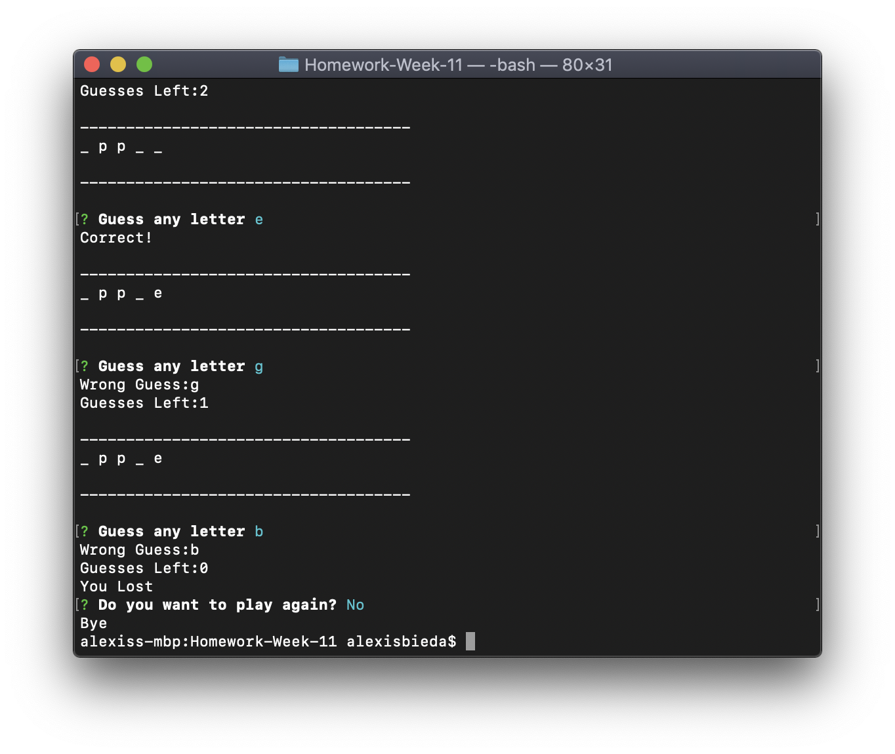

# Constructor-Word-Guess

## DESCRIPTION

The constructor word guess game is a command-line game using constructor functions. 

###### The following are the parameter options:

```node index.js```


## DIRECTIONS

###### Video Walkthrough:
https://youtu.be/OXoxvqQ1TOA

1. Open your terminal

2. Navigate to the folder that project folder that has the index.js file in it

3. Use the commands above to run the application and receive feedback

4. Guess a letter to see if you could get word right (the word category is fruit)


   
5. If you get the word right you will be automatically sent to the next word. If you get the word wrong you will be asked if you want to play again.





